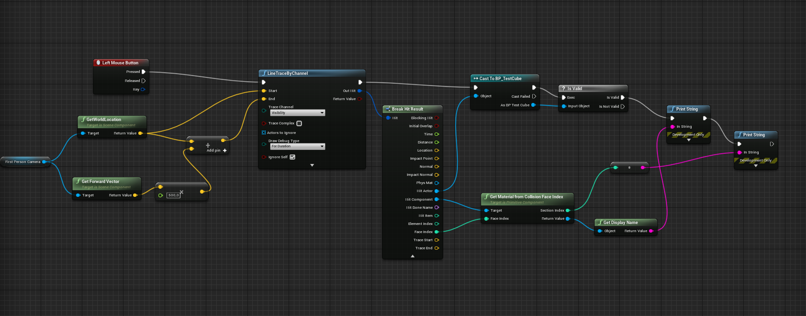
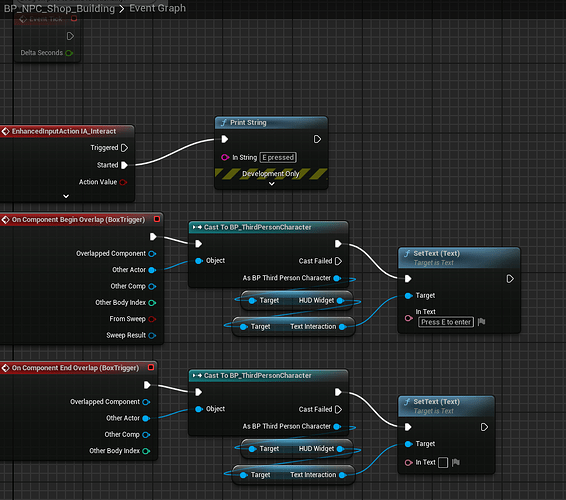
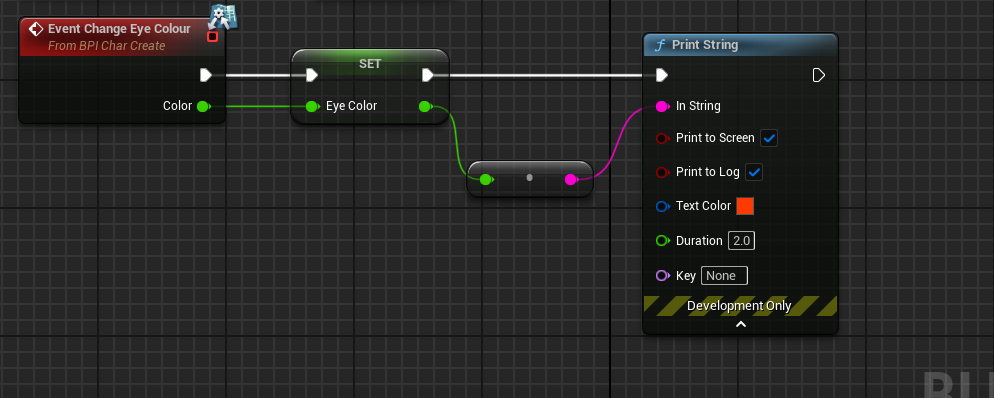

# Unreal Engine Interaction System

A modular interaction system built in Unreal Engine using Blueprints.
The player can detect and interact with objects using a camera-based line trace and a Blueprint Interface.

---

## 🎯 Features

* Camera-based interaction detection (Line Trace)
* Interface-based communication (no casting)
* Modular and reusable system
* Easy to expand for UI, animations, or FX

---

## 🧠 System Breakdown

### 🔍 Line Trace Detection

The player uses a Line Trace from the camera forward vector to detect objects in front of them.
If the hit actor implements the interaction interface, it is stored as the current interactable target.

---

### 🎮 Interaction Input

When the player presses the interact key (E), the system checks if a valid interactable object is stored.
If so, it sends an interaction message using the Blueprint Interface.

---

### 🧱 Interactable Object

Each interactable actor implements a shared interface with an Interact function.
This allows different objects to respond to interaction without requiring direct references or casting.

---

## 🚀 Future Improvements

- Add visual feedback (outline/highlight) when targeting interactable objects  
- Implement a UI prompt ("Press E to interact")  
- Support different interaction types (hold, toggle, timed interaction)  
- Integrate animations and Niagara effects for feedback  
- Improve trace logic with distance prioritisation and object filtering  

---

## ⚠️ Note

Some images are temporary placeholders for documentation purposes.  
They will be replaced with screenshots from the actual project as development progresses.
